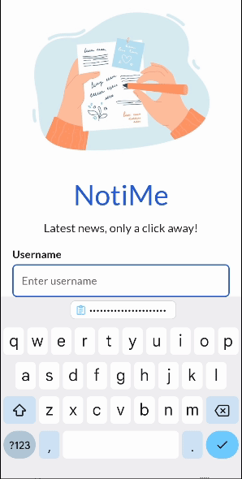
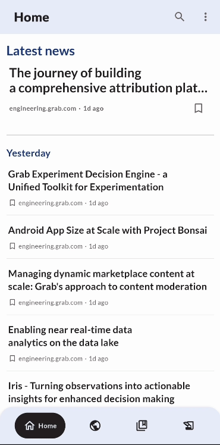
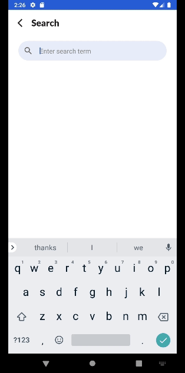
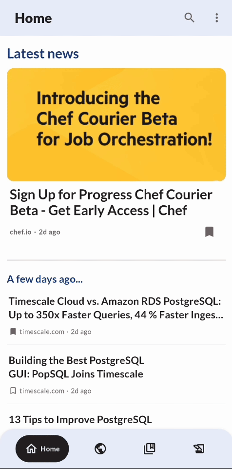
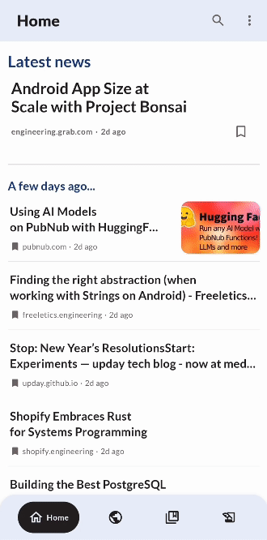

# NotiMe_GrabBootcamp
## Personal evaluation
NOTE: *Please checkout the code on branches to evaluate each individual commitment, there commits will be isolated on there braches.*
## Architecture design

## Data pipeline

## Demo

     

### Login and Home page
- User personal contents are protected
- Ease of use and informative home page

        

     

### Summary and Recommendation
- Content will be summarize for readers using LLM model
- At the end, you can be recommended with wonderful related articles from our database

        

     

### Search - View - Add a new source
- Search a source of your choice
- Add source to get later notification

        

     

### Search our available contents
- Search available articles
- Faster to follow our available source providers

        

     

### Bookmark and Save your favourite articles
- Create a new bookmark for favor list
- Save your favor articles
